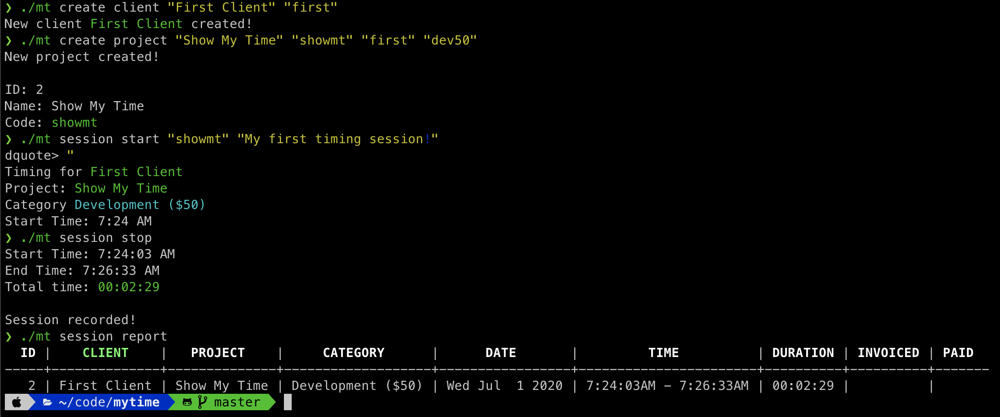
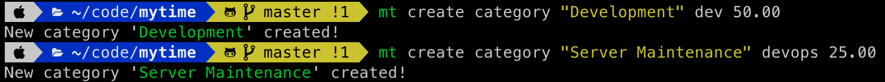
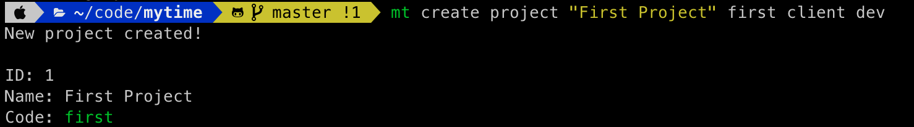
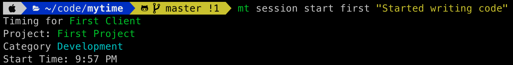
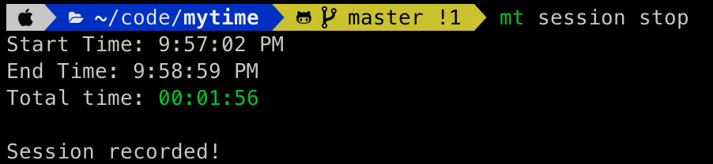
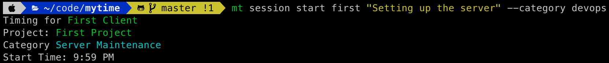
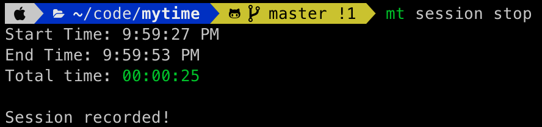
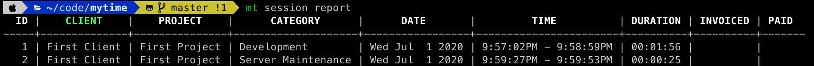

# My Time

My Time is a command-line time tracking, reporting, and invoicing tool. It was built with similar functionality to [Watson](https://tailordev.github.io/Watson/), with additions to match what I liked about the excellent [Office Time](https://www.officetime.net) for Mac. My Time provides the ability to create clients with projects, and categories to describe the type and dollar amount for each timing session. Sessions are simply durations of tracked time. Once you've actually invoiced a client using your 3rd party tool of choice, My Time allows you to mark sessions as invoiced, leting you keep track of which entries are awaiting invoicing or awaiting payment. Once your client pays your invoice My Time then allows you to mark sessions as paid. Using the reporting mechanism of My Time you can keep track of how much time is spent on projects, which time sessions need to be billed, and which ones finally paid.



## Getting Started

The first step in using My Time is to setup clients, categories, and projects. A **client** represents someone you are doing work for. This could be a business, individual, or even yourself. A **category** is a way to organize sessions, which are time entries. Categories have a dollar amount attached to them. Sessions are grouped up under **projects**, which are tied to a client. Let's start by making a client.

```bash
$ mt create client "First Client" client
```


The above command will create a client named **First Client** which has a code of *client*. Codes in My Time are short-hand ways to reference data such as clients, projects, and categories. Now, let's create some categories. Let's say you are a developer who charges different rates for server maintenance vs writing code. Based on that we'll create two categories.

```bash
$ mt create category "Development" dev 50.00
$ mt create category "Server Maintenance" devops 25.00
```



Now, let's say you have a new project to write an application for your **First Client**. Let's make a project where the default category is **Development**, and has a code of *first*.

```bash
$ mt create project "First Project" first client dev
```



The above created a project named "First Project", with a code of "first", related to the client "First Client", and has a default category of "Development".

Cool, so now it is time to do some work. You will want to start a timing **session**. This is simple.

```bash
$ mt session start first "Started writing code"
```



The above command will start timing against the project "First Project", and will attach a note "Started writing code". Since you didn't provide a category the default category for this project is used, which is "Development". Now let's say that done, and it's time to setup a server. First, you'll want to stop timing your current session, then start a new one.

```bash
$ mt session stop
$ mt session start first "Setting up the server" --category devops
```





Now we'll be timing using the "Server Maintenance" category.

Next let's stop timing that, and take a look at what time we've recorded.

```bash
$ mt session stop
$ mt session report
```






## License

Copyright 2020 Adam Presley 

Permission is hereby granted, free of charge, to any person obtaining a copy of this software and associated documentation files (the "Software"), to deal in the Software without restriction, including without limitation the rights to use, copy, modify, merge, publish, distribute, sublicense, and/or sell copies of the Software, and to permit persons to whom the Software is furnished to do so, subject to the following conditions:

The above copyright notice and this permission notice shall be included in all copies or substantial portions of the Software.

THE SOFTWARE IS PROVIDED "AS IS", WITHOUT WARRANTY OF ANY KIND, EXPRESS OR IMPLIED, INCLUDING BUT NOT LIMITED TO THE WARRANTIES OF MERCHANTABILITY, FITNESS FOR A PARTICULAR PURPOSE AND NONINFRINGEMENT. IN NO EVENT SHALL THE AUTHORS OR COPYRIGHT HOLDERS BE LIABLE FOR ANY CLAIM, DAMAGES OR OTHER LIABILITY, WHETHER IN AN ACTION OF CONTRACT, TORT OR OTHERWISE, ARISING FROM, OUT OF OR IN CONNECTION WITH THE SOFTWARE OR THE USE OR OTHER DEALINGS IN THE SOFTWARE.
